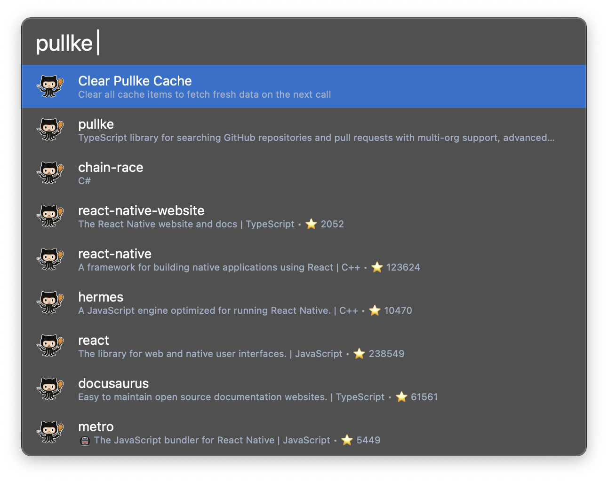
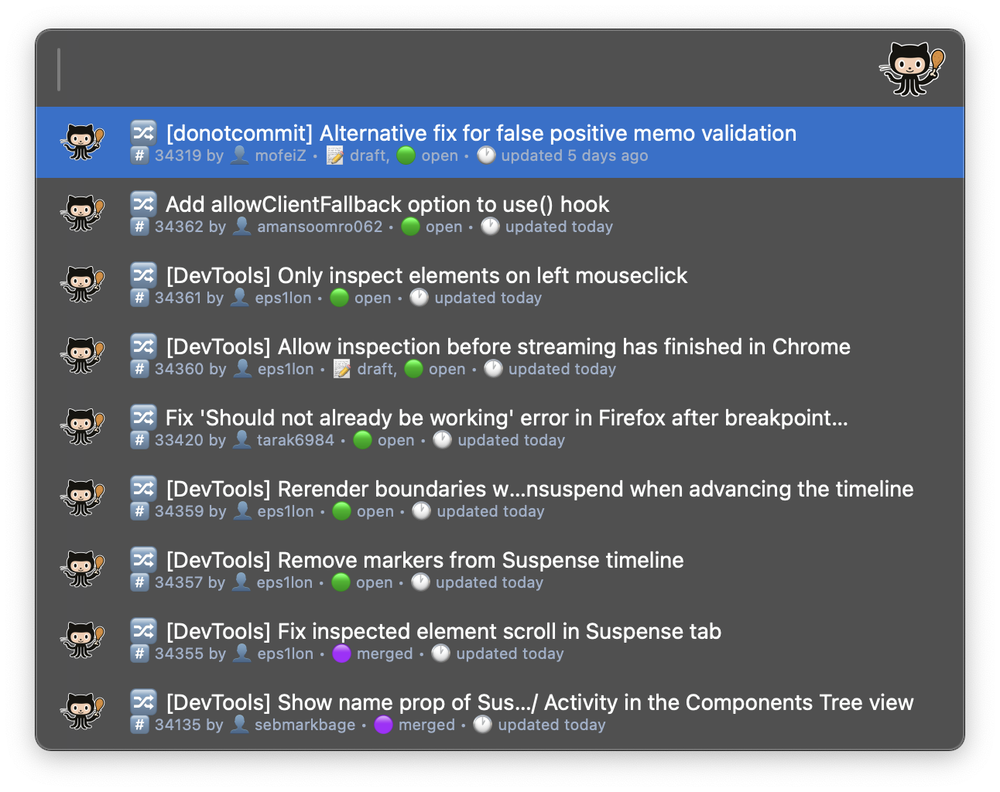
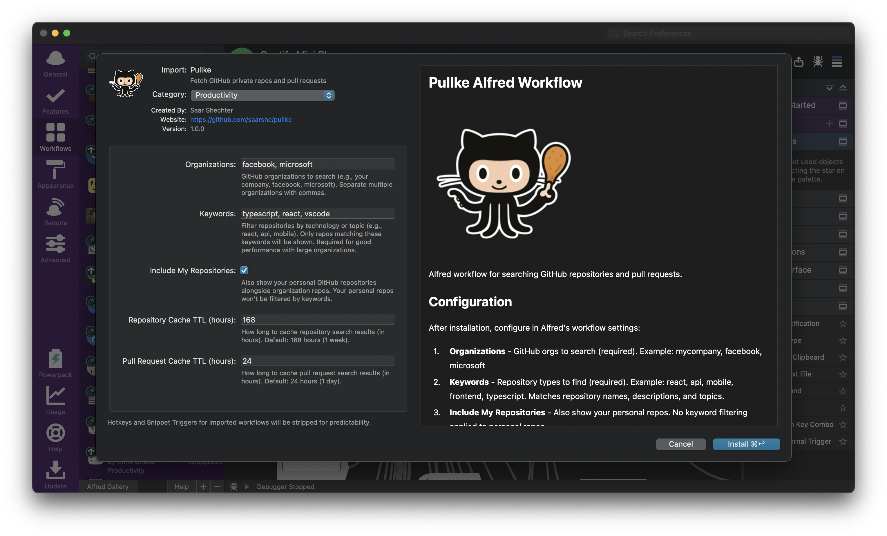

# @pullke/alfred

  

Alfred workflow for searching GitHub repositories and pull requests.

## Screenshots

### Repository Search

*Search repositories across your organizations with keyword filtering*

### Pull Requests Search

*Search pull requests across your repositories with filtering by title (coming soon - filter by author, status, creation date, etc.)*

### Configuration Settings

*Easy setup through Alfred's workflow preferences*

## Installation

### Prerequisites
- Alfred 4+ with Powerpack
- Node.js 18+
- GitHub CLI: `brew install gh && gh auth login`

### Install Workflow

1. Download `Pullke.alfredworkflow` from [Releases](https://github.com/saarshe/pullke/releases)
2. Double-click to install in Alfred

## Configuration

After installation, configure in Alfred's workflow settings:

1. **Organizations** - Which GitHub organizations to search (required)
   - Examples: `mycompany, facebook, microsoft`
   - Works with both public and private organizations (if you have access)

2. **Keywords** - What types of repositories to find (required)
   - Examples: `react, api, mobile, frontend, typescript`
   - Searches in: repository names, descriptions, and topics/tags
   - Shows repos matching ANY of these keywords
   - Required for good performance with large organizations

3. **Include My Repositories** - Also show your personal repos
   - Shows ALL your personal repositories (no keyword filtering)
   - Useful for finding your own projects alongside company repos

4. **Cache Duration** - How long to remember results locally (default: 1 week)
   - Longer = faster searches, shorter = more up-to-date results
   - All data stays on your machine (no external servers)

## Usage

- `pullke` - Search repositories
- `pullke cc` - Clear cache

### Actions
- **Enter** - Open pull requests for selected repo
- **⌘ + Enter** - Open repository in browser  
- **⌥ + Enter** - Copy repository URL

## Requirements

- GitHub CLI (`gh`) or `GITHUB_TOKEN` environment variable
- Organizations and keywords configured in workflow settings